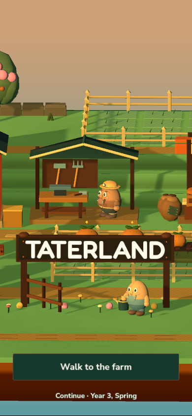

# Taterland

**A farming game where you lose money.**

Grow potatoes, watch the weather and try to keep the farm for ten years. Every Winter, Nell opens the accounts. Seeds, storage, repairs, mortgage and living costs all count. A full barn can still leave a negative number.

Choose what to plant, when to sell and what to protect. From year three, decide whether to spend scarce money on a farm shop, contract growing or lodging. The climate keeps getting harder. Survive the tenth Winter to see forty more years play out under a caretaker—and find out what your farm becomes.

The round potato farmer, villagers and handmade 3D island remain, with wood, ink-green frames and cream paper highlights. Your guided first year takes one crop from its seed card through a small Summer storm, a real loss notice, harvest, a sell-or-store choice and the first annual ledger. Later help is optional.

This is **v2.0.0 (underdevelopment: m)**. Nell's first guided Winter accounts keep the full bills and show one matching “Year one covered by the last harvest” credit. Skipping the guide receives none; later years stand on their own. Segment 21c's golden-hour gate title, paper/wood/ink surfaces, drawings, shorter guidance and moving panels remain. See the [style board and screen review](docs/style-board/README.md), [gameplay guide](docs/GAMEPLAY.md) and [redesign plan](docs/REDESIGN_PLAN.md). Use `v2.0.0-underdevelopment-m` for this prerelease or `redesign` for ongoing work.

**[Play the existing v1.0.3.1 browser build](https://coursemain.github.io/Taterwake/)** — the published site still contains the previous game. To try this redesign, run or export the current source below.

## Download the development browser release

For this redesign, use **Taterland-Web.zip** from [underdevelopment m](https://github.com/CourseMain/Taterwake/releases/tag/v2.0.0-underdevelopment-m). The same release includes **Taterland-Phone-Test.zip** and the screenshot/test review bundle. To export the source yourself, follow [Build the browser edition](#build-the-browser-edition). Extract the entire archive. On macOS, double-click **Play Web.command**; on Windows, double-click **Play Web.bat**. These local launchers need Python 3. Keep their terminal open while playing.

You can also run `python3 serve.py --open` from the extracted folder. Open the printed HTTP address instead of opening `index.html` directly.

Browser saves belong to your browser and the address you use. Return through the same localhost port to continue your farm. Browser saves are separate from desktop saves.

Touch screens get a compact interface with large controls and scrolling menus. Desktop keeps keyboard, mouse and trackpad controls. Both support map pan, zoom and fullscreen. The angled 3D view stays fixed for readable farming.

## Run the source

Check out the `v2.0.0-underdevelopment-m` tag or the `redesign` branch. Use **Godot 4.7.2** with the Compatibility renderer. Import `project.godot` into Godot and press **F5**, or run:

```sh
godot --path .
```

On macOS, **Play Taterland.command** locates Godot automatically. Set `GODOT_BIN` if your engine is installed elsewhere.

## Controls

| Control | Action |
| --- | --- |
| Touch stick / WASD / arrow keys | Move (outer stick edge sprints) |
| Hold Shift | Sprint while moving or following a clicked destination |
| Click a bed | Walk over and use the selected tool |
| Click a tank | Walk over and refill the watering can |
| Click a sprinkler / drain / trees | See connected beds and equipment actions |
| 1 / 2 / 3 / 4 / 5 | Hoe / seeds / water / harvest / pest sprayer |
| E / Space | Interact with the nearby NPC/shop, use a tool beside a bed, or use nearby equipment |
| Mouse drag / two-finger trackpad scroll | Pan the map |
| One- or two-finger touch drag | Pan the map |
| Pinch / mouse wheel | Zoom the map |
| Home / Touch Tools → Recenter | Restore the camera |
| Top-left expand/× icon / F11 | Toggle fullscreen |
| Touch Tools drawer | Select tools and seeds, zoom +/−, recenter, cancel a task |
| I | Crops and tools |
| B / U | Market / tool upgrades |
| F | Sell the selected crop |
| Hold H / touch Hold to hurry | Run the simulation at 3× while held |
| F1 | Optional help and Valley tour |
| Escape / ☰ | Main menu and remaining activities |

The first-year guide selects your tools and pauses at each decision. After the first accounts, close the ledger to work through Winter and prepare for Spring. **F1** opens optional help and the Valley tour. Winter’s jobs card and farm menu offer **Sleep until Spring**, with a stored-crop quote before confirmation.

See the [gameplay guide](docs/GAMEPLAY.md) for crop choices, the annual bills, climate protection and the ending.

## Build the browser edition

Install the Web export templates matching your Godot version, then run:

```sh
python3 tools/export_web.py
python3 tools/serve_web.py --open
```

On macOS, **Export Web.command** runs both steps. Use `--godot /path/to/godot` or `GODOT_BIN` to choose an engine. The exporter creates `dist/web/` and `dist/Taterland-Web.zip`, and keeps the previous working build if export fails. Python 3.10 or newer is recommended.

The exported game can also run on a static HTTP/HTTPS host. Upload `index.html` and its supporting files together, preserving their relative paths. The ZIP includes font and Godot license notices.

See [development notes](docs/DEVELOPMENT.md) for saves, checks and project layout.
