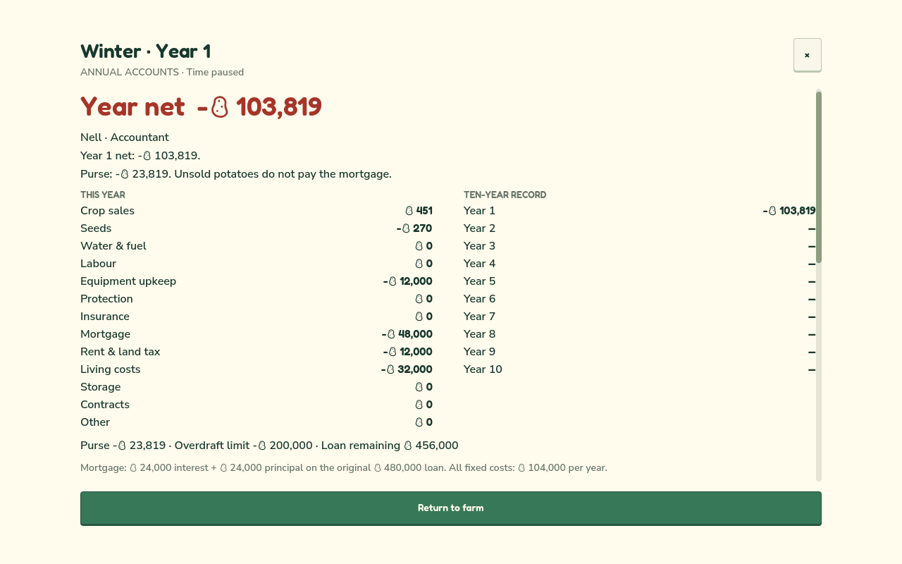

# Taterland

**A farming game where you lose money.**

Grow potatoes. Pay the mortgage. Hope the next season leaves enough to do it again.

Taterland is a farming survival game about keeping a small farm for ten years as the climate turns against you. Choose what to plant, when to sell and what to protect. Every Winter, your accountant opens the ledger. A good harvest can still be a bad year.

- Five crop cards, with visible water needs, climate tolerances and prices.
- Manual farming on a handmade 3D island, with a round potato farmer and talking potato villagers.
- Weather warnings and cause cards that explain what was lost and what could have saved it.
- Annual bills, storage risks, insurance and a politely unwelcome bank manager.
- Farm shops, contract growing and lodging from year three: another income means less money for protection.
- A guided first year that ends at the first accounts. Later help is yours to open.
- A fifty-year ending: a caretaker continues from your final farm, revealing what your choices leave behind.

Ten years of work. Forty more of consequences. Seven possible futures, from Dust to Thriving.

Development copy for the current redesign source. The published browser build still contains the previous game; this copy does not announce a new public release.
