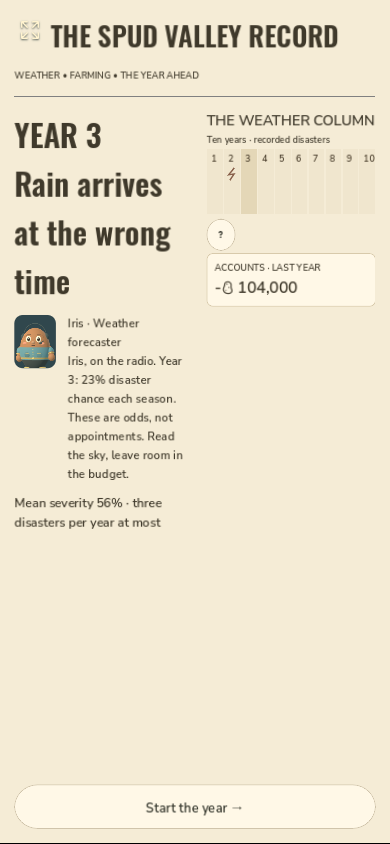
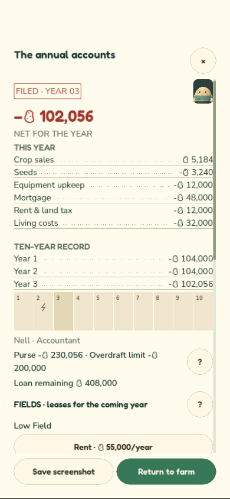
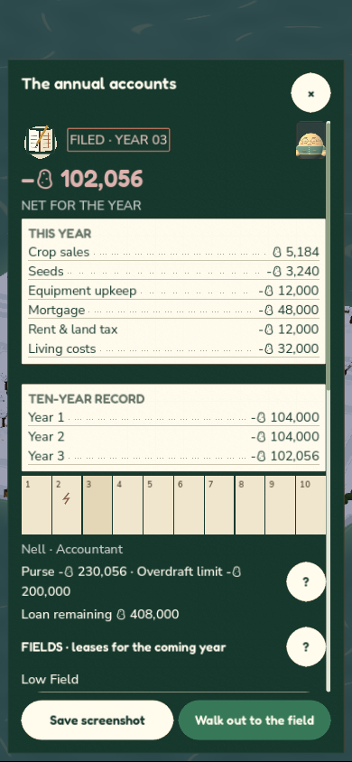
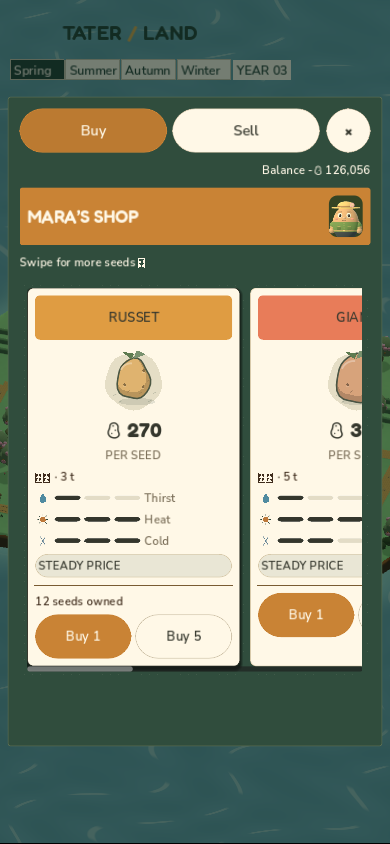
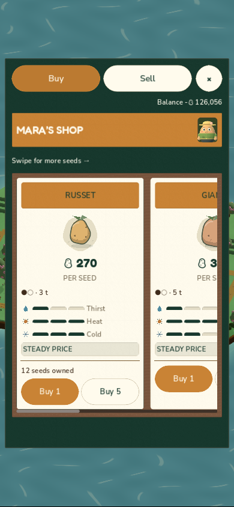
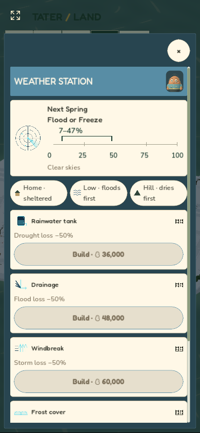
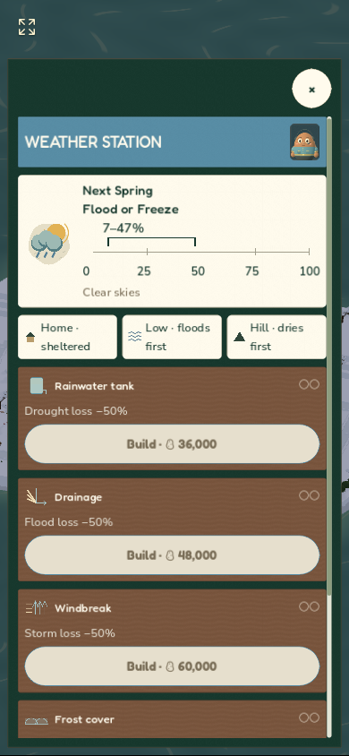

# Segment 21c — before and after

Every comparison below is an unedited **390×844** browser screenshot. Before is tag `v2.0.0-underdevelopment-k`; after is the Segment 21c build for `v2.0.0-underdevelopment-l`. The disposable fixture uses the same farm, journal and inventory for both versions; it never reads a player's save.

The old opening actually displayed Iris’s annual front page. The unused “Welcome to Taterland” modal initializer has also been removed. The new opening frames the real gate, with an eight-second pullback, quiet water and temporary dusk lighting.

| Screen | Before | After |
| --- | --- | --- |
| Title | [](taterland-before/title.png) | [](taterland-after/title.png) |
| Accounts | [](taterland-before/accounts.png) | [](taterland-after/accounts.png) |
| Crop card | [](taterland-before/crop-card.png) | [](taterland-after/crop-card.png) |
| Forecast | [](taterland-before/forecast.png) | [](taterland-after/forecast.png) |

The [title after its pullback](taterland-after/title-pullback.png) keeps moving without a cut. The [farm menu](taterland-after/menu.png) shows the corrected dark text on cream action buttons. [Nell’s conversation](taterland-after/npc-nell.png), [the barn](taterland-after/barn.png), [the workbench](taterland-after/tools.png), [the front page](taterland-after/front_page.png), [foreclosure](taterland-after/foreclosure.png) and the other captured pages are covered in [the screen review](REVIEW.md).

Reproduce the matched fixture:

```sh
python3 tools/export_browser_benchmark.py --godot "$GODOT_BIN" --source <checkout> --fixture surfaces --label surfaces-review
python3 tools/serve_web.py --directory artifacts/browser-benchmark-surfaces-review-web --port 8911
# In another terminal, with Playwright installed:
NODE_PATH=<directory-containing-playwright> node tests/capture_surfaces_browser.cjs http://127.0.0.1:8911/index.html <capture-directory> --all
```

Set `CHROME_BIN` if Chrome is installed elsewhere. `--desktop` captures the farm menu at 1280×800. Browser emulation checks layout and rendering; it is not the outstanding real-phone year measurement or Segment 22's human playtest.
