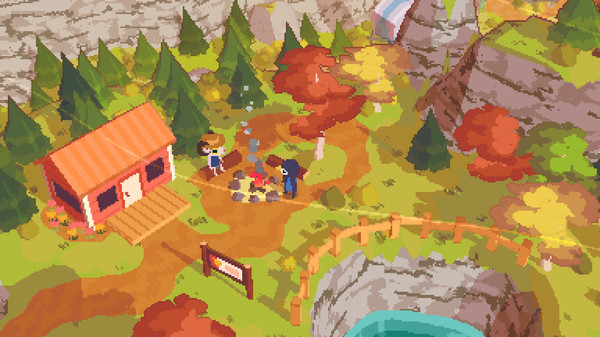
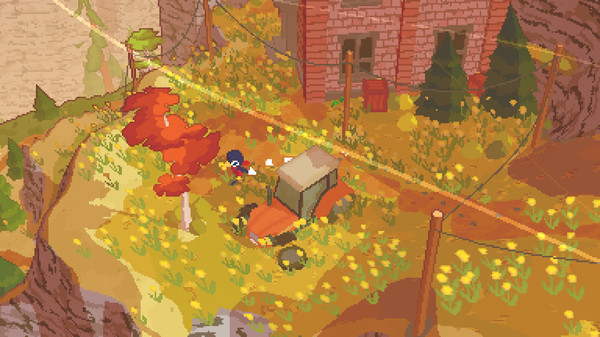
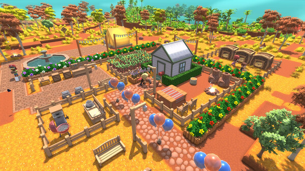
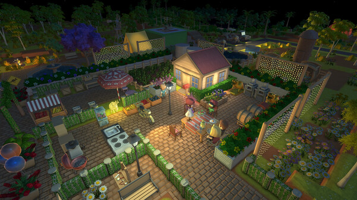
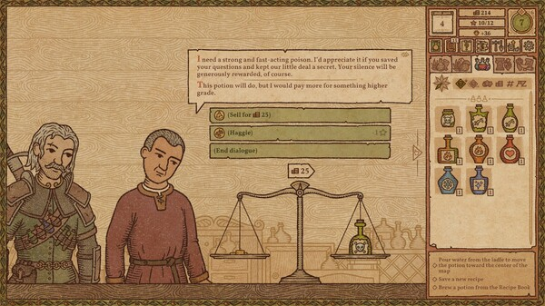
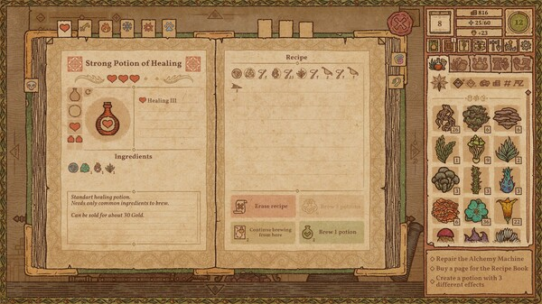
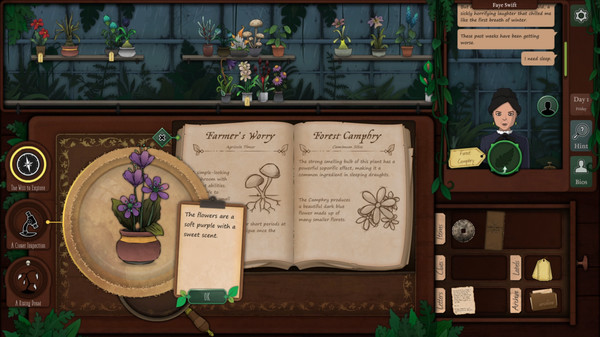
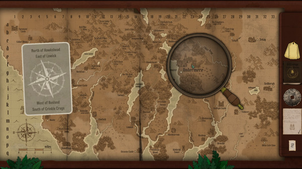
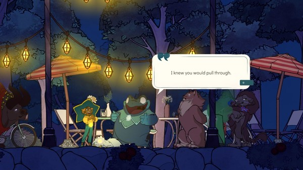
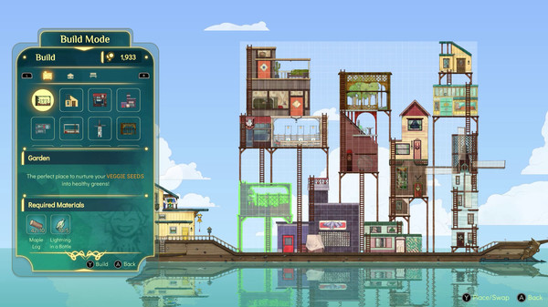

# Taterland — surfaces and voice

Pinned before Segment 21c production edits, 4 October 2026. Ten official store screenshots are visual references for Taterland’s round farmer, hand-built islands and village keepers. The screenshots remain the property of their credited creators; they are inspiration and review material, not shipped game assets. These are the store’s compact screenshot copies, with no cropping or paint-over.

## A small cabin at golden hour — A Short Hike

A warm roof, timber fence and cool greenery make one friendly destination readable before any interface appears.

Credit: adamgryu. [Official store](https://store.steampowered.com/app/1055540/) · [Source screenshot](https://shared.akamai.steamstatic.com/store_item_assets/steam/apps/1055540/ss_f2123fea859e299736a3e99d130238c784d53e75.600x338.jpg?t=1777758958).

## An evening path — A Short Hike

The path and its little lights lead the eye. Leave room for the farmer and let the landscape carry the welcome.

Credit: adamgryu. [Official store](https://store.steampowered.com/app/1055540/) · [Source screenshot](https://shared.akamai.steamstatic.com/store_item_assets/steam/apps/1055540/ss_4c7c9650606ac7b451f8d2e5b71b503649e43edc.600x338.jpg?t=1777758958).

## A lived-in farm — Dinkum

Beds, sheds and paths read as different physical things. The warm ground holds the scene together.

Credit: James Bendon. [Official store](https://store.steampowered.com/app/1062520/) · [Source screenshot](https://shared.akamai.steamstatic.com/store_item_assets/steam/apps/1062520/ss_767bcbda803dfceedee650dfcbae8a52fbd2b1b7.600x338.jpg?t=1767607973).

## A farm after dusk — Dinkum

Amber windows and lamps sit inside deep green surroundings. Warmth comes from points of light, not a white overlay.

Credit: James Bendon. [Official store](https://store.steampowered.com/app/1062520/) · [Source screenshot](https://shared.akamai.steamstatic.com/store_item_assets/steam/apps/1062520/ss_1325a4d57f22edce9019c03f3d78f3ed5150fbec.600x338.jpg?t=1767607973).

## A shop conversation — Potion Craft: Alchemist Simulator

The keeper, counter and drawn goods make the transaction feel situated. Portrait and object drawings carry identity.

Credit: niceplay games. [Official store](https://store.steampowered.com/app/1210320/) · [Source screenshot](https://shared.akamai.steamstatic.com/store_item_assets/steam/apps/1210320/ss_594f4f435a27c625e0f5c8d3603883c9e293b967.600x338.jpg?t=1786023837).

## An open book — Potion Craft: Alchemist Simulator

The book has leaves, a spine and tabs. Its shape says what it is before a heading is read.

Credit: niceplay games. [Official store](https://store.steampowered.com/app/1210320/) · [Source screenshot](https://shared.akamai.steamstatic.com/store_item_assets/steam/apps/1210320/ss_2ee267fdbdac585741df64403ff45a746cdf725a.600x338.jpg?t=1786023837).

## Paper on a wooden counter — Strange Horticulture

A light book rests on dark wood with a green room behind it: three materials with clear depth and purpose.

Credit: Bad Viking. [Official store](https://store.steampowered.com/app/1574580/) · [Source screenshot](https://shared.akamai.steamstatic.com/store_item_assets/steam/apps/1574580/ss_bdf4e7e6ab970f19c95ae96896e9457a95dbdf65.600x338.jpg?t=1772459223).

## A working map — Strange Horticulture

Grain, fine ink and small drawings make paper feel handled. Texture supports the content without competing with it.

Credit: Bad Viking. [Official store](https://store.steampowered.com/app/1574580/) · [Source screenshot](https://shared.akamai.steamstatic.com/store_item_assets/steam/apps/1574580/ss_741db5d7020d737ea8aba278e95f7111d7ca8f6e.600x338.jpg?t=1772459223).

## A lantern-lit conversation — Spiritfarer®: Farewell Edition

Blue-green dusk keeps the lanterns and characters warm. One small light speech shape leaves the world visible.

Credit: Thunder Lotus. [Official store](https://store.steampowered.com/app/972660/) · [Source screenshot](https://shared.akamai.steamstatic.com/store_item_assets/steam/apps/972660/ss_a751970e68bc928538fbc4f52d6090c6ff1d8974.600x338.jpg?t=1752503178).

## A dark working board — Spiritfarer®: Farewell Edition

The deep green tool board holds pale type and small object pictures. Cream highlights information instead of filling the whole screen.

Credit: Thunder Lotus. [Official store](https://store.steampowered.com/app/972660/) · [Source screenshot](https://shared.akamai.steamstatic.com/store_item_assets/steam/apps/972660/ss_6ae155cb7c5f65f46a8f0dc43ba57aff8f57616c.600x338.jpg?t=1752503178).

## Three rules

1. **Wood holds the place.** Use one walnut tone (`#79553d`) for boards, counters and structural bands; deep green ink (`#17382d`) frames large panels. A building owns its panel shape and accent, and the panel moves out from that building. The farm stays visible and moving.

2. **Paper holds the facts.** Reserve cream for the readable leaf, ticket or small highlight, roughly one third of the composition. Never stack three cream surfaces: the third is wood or ink. Use subtle grain and a darker inner edge, with one small keeper-style drawing per object. The ledger is a book, a crop is a seed packet, and the forecast is a pinned weather slip.

3. **Dusk holds the welcome.** Open on warm low sunlight, cool green shadows and a slowly moving farm. Put the name on the gate and only two actions along the bottom. Keep people and tools legible at phone size; let small warm highlights guide the eye without whitening the scene.
